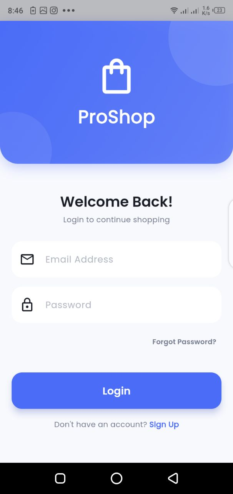
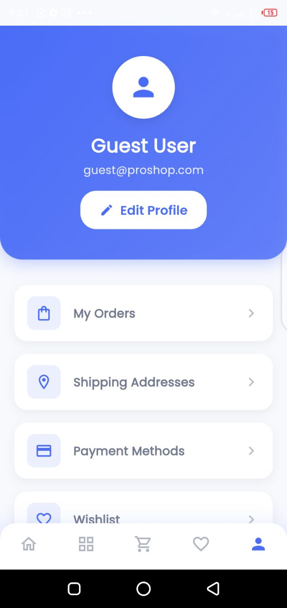
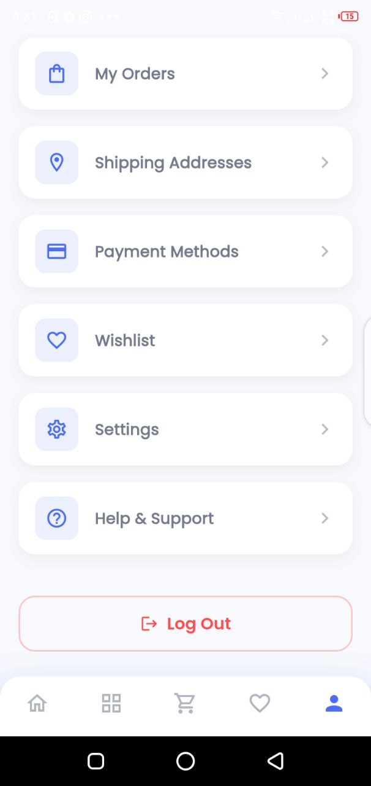

# ProShop — Flutter E-Commerce App

ProShop is a modern **frontend e-commerce app** built with Flutter. It allows users to browse products, view product details, add items to cart or favorites, and explore a clean, intuitive shopping interface.

The app focuses purely on **UI/UX design** and does not include backend integration.

---

## Screenshots

<table>
  <tr>
    <td></td>
    <td></td>
    <td></td>
    <td></td>
  </tr>
  <tr>
    <td></td>
    <td></td>
    <td></td>
    <td></td>
  </tr>
</table>

---
